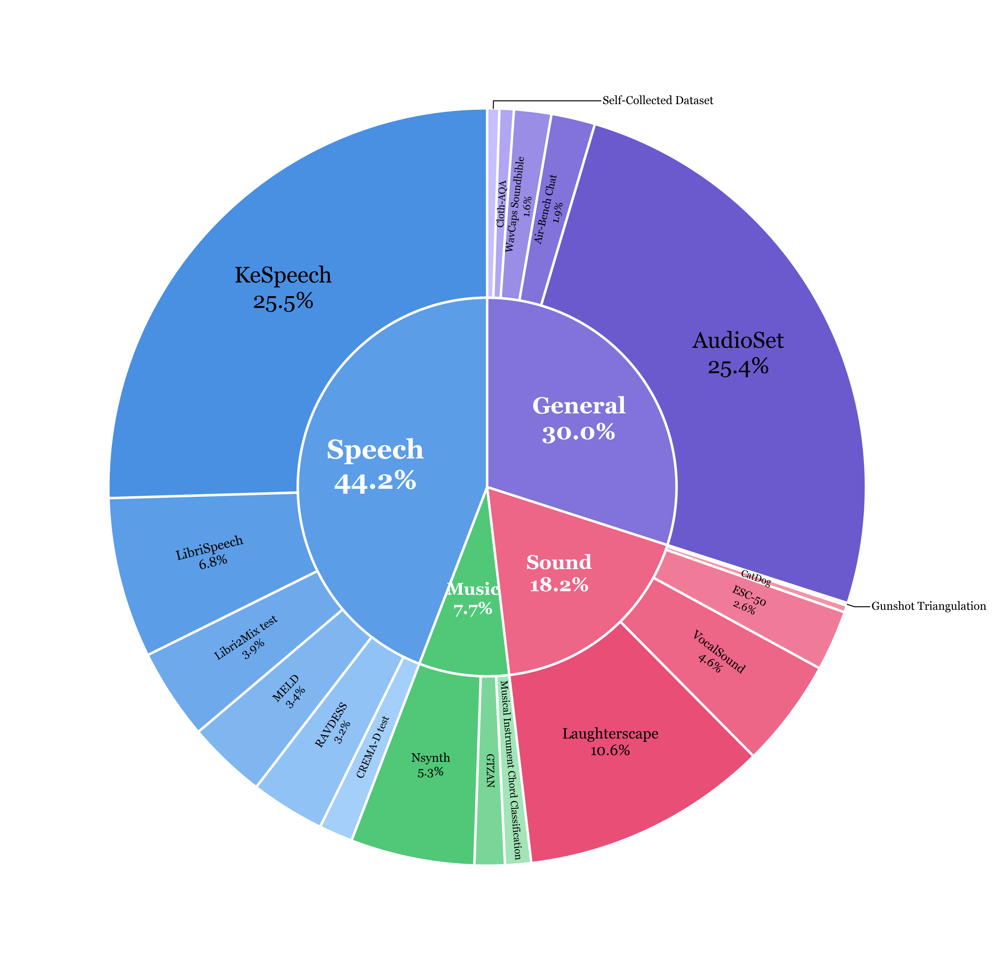

# CodecBench: A Comprehensive Benchmark for Acoustic and Semantic Evaluation

## Introduction

`CodecBench` is a comprehensive framework designed to evaluate the performance of codec and ASR models in both **reconstruction** and **semantic** tasks.

## Data
We use 18 open-source datasets and 1 self-collected dataset.


| Dataset | Metadata For Classification Task |
|---------|----------------------------------|
| [KeSpeech](https://huggingface.co/datasets/TwinkStart/KeSpeech) | / |
| [LibriSpeech](https://huggingface.co/datasets/sanchit-gandhi/librispeech-data) | / |
| [Libri2Mix](https://huggingface.co/datasets/Codec-SUPERB/libri2Mix_test_synth) | / |
| [MELD](https://huggingface.co/datasets/TwinkStart/MELD) | [meld.csv](metadata/meld.csv) |
| [CREMA-D](https://huggingface.co/datasets/confit/cremad-parquet) | [crema_d_test.csv](metadata/crema_d_test.csv) |
| [RAVDESS](https://huggingface.co/datasets/birgermoell/ravdess) | / |
| [NSynth](https://huggingface.co/datasets/TwinkStart/Nsynth) | [nsynth.csv](metadata/nsynth.csv) |
| [GTZAN](https://huggingface.co/datasets/TwinkStart/GTZAN) | [gtzan.csv](metadata/gtzan.csv) |
| [Musical Instrument Chord Classification](https://huggingface.co/datasets/TwinkStart/chord_recoganition) | [chord_recognition.csv](metadata/chord_recognition.csv) |
| [Laughterscape](https://huggingface.co/datasets/RayYuki/CodecBench_laughterscape_ver1.0) | / |
| [VocalSound](https://huggingface.co/datasets/TwinkStart/vocalsound) | [vocalsound](metadata/vocalsound.csv) |
| [ESC-50](https://huggingface.co/datasets/ashraq/esc50) | [esc50.csv](metadata/esc50.csv) |
| [CatDog](https://huggingface.co/datasets/TwinkStart/CatDog) | / |
| [Gunshot Triangulation](https://huggingface.co/datasets/Codec-SUPERB/gunshot_triangulation_synth) | / |
| [AudioSet](https://huggingface.co/datasets/Codec-SUPERB/audioset_synth) | / |
| [Air-Bench Chat](https://huggingface.co/datasets/TwinkStart/air-chat) | / |
| [WavCaps Soundbible](https://huggingface.co/datasets/TwinkStart/wavcaps-soundbible) | / |
| [Clotho-AQA](https://huggingface.co/datasets/TwinkStart/ClothoAQA) | / |
| [Self_collected_dataset](https://huggingface.co/datasets/RayYuki/CodecBench_collected_data) | / |

## Code Structure
- `semantic_evaluation/` - Code for evaluating the semantic performance of codec/ASR models.
- `reconstruct_evaluation/` - Code for evaluating the reconstruction performance of codec models.
- `speechtokenizer/` - Contains codec or ASR models.
- `utils/` - Utility scripts and common functions.

## Installation

```bash
# Clone the repository
git clone https://github.com/RayYuki/CodecBench.git
cd CodecBench

# Create a Conda environment and install dependencies
conda create -n CodecBench python=3.10 -y
pip install -r requirements.txt

# Set the Python path
export PYTHONPATH=./
```

### Visqol installiation

#### get visqol repository:
`git clone https://github.com/google/visqol`

#### Install Bazel (take version 5.1.0 as an example):
```
wget https://github.com/bazelbuild/bazel/releases/download/5.1.0/bazel-5.1.0-installer-linux-x86_64.sh 
chmod +x bazel-5.1.0-installer-linux-x86_64.sh
./bazel-version-installer-linux-x86_64.sh --user
export PATH="$PATH:$HOME/bin"
export PATH="$PATH:$HOME/.bashrc"
export PATH="$PATH:$HOME/.zshrc"
```

#### revise compile config and compile. You may need 32G memory for this stage
1. add `build --linkopt=-lstdc++fs` after line 55 of `.bazelrc`
2. replace the version to `5.1.0` in `.bazelversion`
3. update `WORKSPACE` to new armadillo version as suggested in https://github.com/google/visqol/pull/119/files
   - for additional note, 10.1.0 is also deprecated. You may consider using
  ```
    sha256 = "023242fd59071d98c75fb015fd3293c921132dc39bf46d221d4b059aae8d79f4",
    strip_prefix = "armadillo-14.4.0",
    urls = ["http://sourceforge.net/projects/arma/files/armadillo-14.4.0.tar.xz"],
  ``` 
4. compile with `bazel build :visqol -c opt`

#### install in python 
`pip install .`

## Evaluation Tasks

### Reconstruction Evaluation
Evaluates codec reconstruction performance on the `librispeech-test-clean` dataset using the following metrics:
- **Speaker Similarity** - Assessed using a [WavLM-based speaker verification model](https://huggingface.co/Dongchao/UniAudio/resolve/main/wavlm_large_finetune.pth) (SPK SIM). Code available at [speaker_similarity.py](reconstruct_evaluation/speaker_similarity.py).
- **STOI** - Short-Time Objective Intelligibility. Code available at [stoi.py](reconstruct_evaluation/stoi.py).
- **PESQ** - Perceptual Evaluation of Speech Quality. Code available at [pesq_local.py](reconstruct_evaluation/pesq_local.py).

### Semantic Evaluation
Fine-tunes an ASR task using:

#### Model
- **Codec/ASR encoder**.
- **Two-layer bidirectional LSTM** with a hidden dimension of **1024**.
- **CTC (Connectionist Temporal Classification) decoder**.

Code available at [finetune_codecforctc.py](semantic_evaluation/finetune_codecforctc.py).

#### Datasets
- **Training dataset**: `librispeech train-clean-100`.
- **Evaluation dataset**: `librispeech-test-clean`.

## Preparing Your Codec Model
To integrate a codec or ASR model for evaluation, ensure the model class provides the following attributes:
- `sampling_rate` - Sample rate of the model.
- `downsample_rate` - Downsampling rate.
- `code_dim` - Embedding size for ASR fine-tuning.
- `forward` method returns a dictionary with:
  - A key **"y"** containing synthesized audio `shape = (B, 1, T)` - *not required for ASR models*.
  - A key **"zq"** containing embeddings for downstream ASR fine-tuning `shape = (B, D, L)`.

For codec models, the hidden representation after RVQ/FSQ is typically used for ASR fine-tuning.

For ASR models, either the top Transformer layer or an average of all layers is used.

Code available at [model.py](speechtokenizer/model.py).

To add a new codec/ASR model, modify [`spt_utils.py`](./utils/spt_utils.py) as follows (example for SpeechTokenizer):

```python
if args.model_type == "SpeechTokenizer":
    codec_model = load_and_fix_speechtokenizer(args.config, args.codec_ckpt)
    target_frame_rate_before_ctc = 50
elif args.model_type == "<your codec / asr model type>":
    codec_model = your_codec_or_asr_model # Ensure all parameters are fixed
    target_frame_rate_before_ctc = your_frame_rate  # Must be a multiple of the model's Hz and >= 50
```

### CTC Considerations
CTC requires that the input length `x` satisfies:
```
x >= 2 * y + 1
```
where `y` is the target sequence length. More details can be found in this [CTC guide](https://distill.pub/2017/ctc/).

**If the input hidden sequence length is too short, the prediction results may not be accurate.**
For low-bitrate codec/ASR models, the hidden representations are upsampled to at least **50 Hz** before fine-tuning the LSTM-CTC ASR model. 
For example, if the codec's VQ operates at **25 Hz**, set:
```python
target_frame_rate_before_ctc = 50
```

## Running Evaluations

### Reconstruction Evaluation
Before running, modify `model_type`, `config`, and `codec_ckpt` in the execution script:
```bash
sbatch reconstruct_evaluation/submit_reconstruct_evaluation.sh
```

### Semantic Evaluation
Before running WER test, modify `model_type`, `config`, and `codec_ckpt` in the execution script:
```bash
sbatch semantic_evaluation/submit_semantic_wer_evaluation.sh
```
Before running classification test, modify `model_type`, `config`, `data_config`, and `codec_ckpt` in the execution script:
```bash
sbatch semantic_evaluation/submit_semantic_classification_evaluation.sh
```

## Acknowledgments
This project was developed with contributions from [**SpeechTokenizer**](https://github.com/ZhangXInFD/SpeechTokenizer). We appreciate its support in providing fundamental codec model functionalities.
